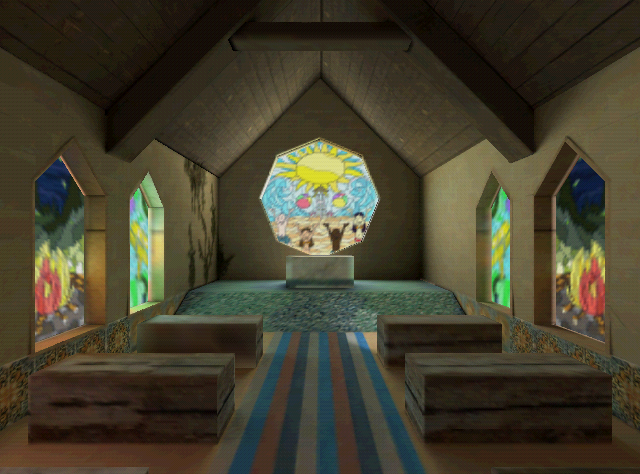

# megatextures



This showcases a demo of megatextures running on n64 hardware. A "megatexture" for the n64 is really just a normal sized textured by modern standards but with that you can do some prebaked scenes that look like they don't belong on the n64.

## building the rom

to build the rom, you need to install a few dependendencies.

First, you will need to setup [Modern SDK](https://crashoveride95.github.io/n64hbrew/modernsdk/startoff.html).

After installing modern sdk you will want to also install

```sh
sudo apt install libnustd
```

Next, you will need to download Blender 3.0 or higher. Then set the environment variable `BLENDER_3_0` to be the absolute path where the Blender executable is located on your system.

```sh
sudo apt install blender
```

e.g. add this to your ~/.bashrc

```bash
export BLENDER_3_0="/usr/bin/blender"
```

Install sfz2n64, mpg123, and sox

```sh
echo "deb [trusted=yes] https://lambertjamesd.github.io/apt/ ./" \
    | sudo tee /etc/apt/sources.list.d/lambertjamesd.list
sudo apt update
sudo apt install sfz2n64 mpg123 sox
```

You will need to install nodejs. You can use apt for this

```sh
sudo apt install nodejs
```

Once you have these dependences, you should be able to run `make` to build the rom. The result will be saved to `build/megatextures.z64`

## editing assets/world/test.blend

If you want to build out a scene that uses megatextures, edit `assets/world/test.blend`.

Any object starting with the name `@megatexture` will be processed as a megatexture. It must have a material with a name that shows up in the file `assets/materials/megatextures.skm.yaml` of the same name. The material in `assets/materials/megatextures.skm.yaml` must point to the location of the texture with the fmt set to `G_IM_FMT_RGBA` and the siz set to `G_IM_SIZ_16b`. 

Texture sizes must be a power of two and at most 1024x1024 in size. Texture coordinates must also be set so the pixels are rectangles. The geometry for a single mega texture must also be flat. 

Becuase no z buffer is used, you should specify a sort_group for a megatexture model. This is done but including the string `sort_group` in the name followed by a number. Negative numbers are pre sorted positive numbers are sorted at runtime with smaller sort groups being drawn before larger sort groups. If the sort group is the same then the distance of the object from the camera in the z direction is used to sort from back to front.